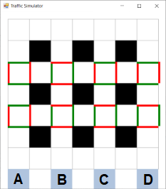

# Traffic Simulation

## Description
Multi-agent system that manages traffic on a street layout with multiple intersections. The streets and intersections are configured as in the following image:

At each intersection, the car agents decide which way to go in a greedy manner, i.e they will choose a direction which:
- is either left, right, or forward;
- is selected such that the total distance from the entry point to exit is equal to the Manhattan distance between the entry point and the exit; for example, if a car wants to get from B to O, it should stay within the rectangle B-C-O-N;
- has no obstacles / the least amount of obstacles.

Possible obstacles are:
- **binary:** a red street light for that direction;
- **continuous:** the amount of traffic in the desired direction (the number of cars in the corresponding road segment).

## Implementation
The elements of the multi-agent system:
- **Configuration parameters:** taken from configuration file;
- **Environment:** turn-based;
- **User Interface:** intersection form;
- **Agents:**
    - *Intersection:* turn-based;
    - *Cars:* turn-based;
    - *Traffic lights:* turn-based.
    
###User Interface
The image below is a screenshot of the application.
The A, B, C and D cells represent the starting points of the agent and the first row represents the destination of the agents.
The white cells are the road segments where the cars can go. The cars are represented by squares with different number and colors.
The black cells are unavailable road segments where cars cannot go. The cars can move to left, up or right. They need to continue or stop when encountering a traffic light on the left, up or right, depending on the light state (green / red).
When arriving to the destination, the cars disappear from the traffic.

###Intersection agent
- **Car Positions**;
- **Traffic lights Positions**;
- **Traffic lights Status**;
- **Number of cars per each cell**;
- Handles the messages from the CarAgent and TrafficLightAgent;
- Sends traffic information to CarAgent and TrafficLightAgent;
- Sends continue or stop to CarAgent based on the traffic light status encountered.

###Car agent
- **Position** (x, y);
- **Starting position** (A / B / C / D);
- **Final destination** (M / N / O / P);
- **Skipped turns:** the delay  until the car starts;
- Starts when the skipped number of turns have passed;
- Computes the path to the destination, depending on the priority;
- Stops if a red light is encountered or continues if it's green.

###Traffic light agent
- **Position** (x, y);
- **State:**
    - **Green** (Green - vertical, Red - horizontal);
    - **Red:** (Red - vertical, Green - horizontal).
- The traffic light have a specified switching time;
- Adjacent traffic lights from each line have opposing values;
- Changes the state when a specified number of turns have passed;
- Receives traffic information to change the state depending on the intelligence level;
- Algorithms for adaptive changing of the switching time are not implemented.

###Multi-agent framework
The framework used can be found at [Florin Leon](https://github.com/florinleon) / [ActressMas](https://github.com/florinleon/ActressMas).

## Usage
The system should be controllable by multiple user-defined parameters, which should be read from a simple config file. The control parameters are:
- **TrafficLightIntelligence** - the intelligence of traffic lights:
    - **L0:** non-intelligent traffic light: the switching time is constant, no matter the traffic;
    - intelligent: the switching time depends on the traffic; in this case, another parameter would be the level of intelligence:
        - **L1:** the street light has knowledge of the amount of traffic in its adjacent street segments;
        - **L2:** the street light has knowledge of the amount of traffic as far as two street segments away from its position;
        - **L3:** the street light has full knowledge of the amount of traffic, on all street segments.
- **CarsRate[A,B,C,D]** - the rate with which cars are generated at each entry point A, B, C, D; cars rate = cars/turn; the delay between turns can be selected is a predefined constant;
- **CarsPriority** - whether cars will prioritize street lights or the amount of traffic, meaning:
    - **NoPriority** - the cars select the path to the destination without taking into consideration the amount of traffic or the traffic lights;
    - **GreenLight** - whether a car at an intersection will choose a street segment with a green light;
    - **LowerTraffic** - whether a car will wait at a red light if there is lower traffic on the following street segment.

## License
The software is licensed under the MIT license.